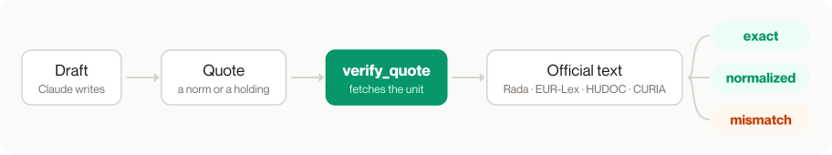
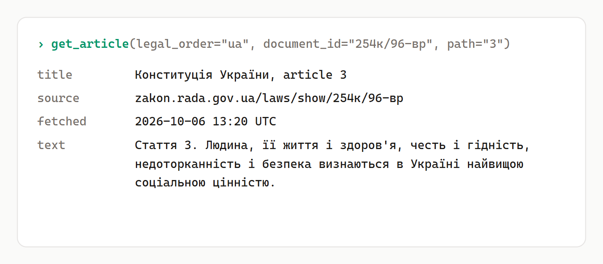
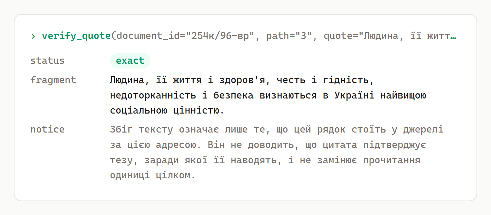
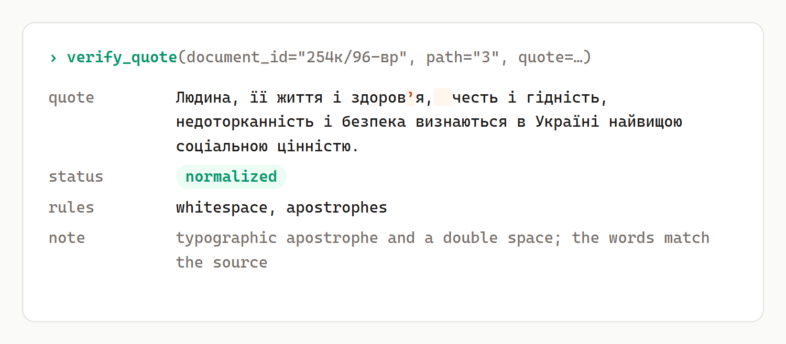
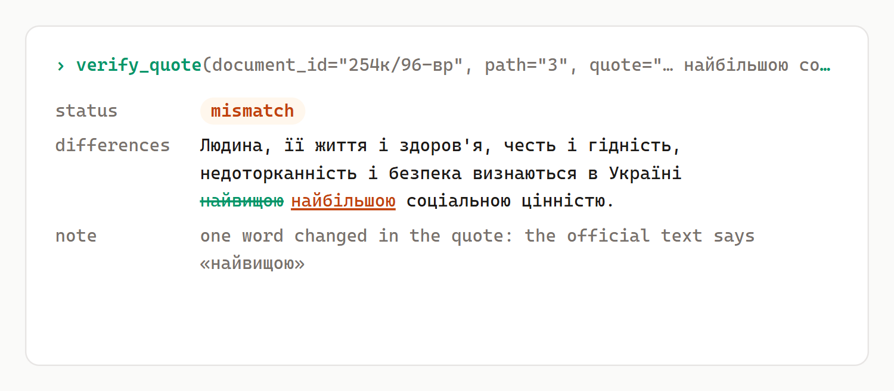

<p align="center">
  <picture>
    <source media="(prefers-color-scheme: dark)" srcset="docs/assets/wordmark-dark.svg">
    
  </picture>
</p>

<h3 align="center">Every legal quote, checked against the official text.</h3>

<p align="center">
  An MCP server for Ukrainian and EU law, ECHR and CJEU case law · <a href="#install">Install</a> · <a href="#what-verify_quote-returns">See real calls</a>
</p>

<p align="center">
  <picture>
    <source media="(prefers-color-scheme: dark)" srcset="docs/assets/flow-dark.svg">
    
  </picture>
</p>

| 19 | 1,007 | 0 |
|:-:|:-:|:-:|
| MCP tools in this public edition | offline tests, no network | free-text queries sent to the sources in the `legal` profile |

<p align="center"><sub>The private build I run has 23 tools. The test suite fails any test that tries to go online; tests that need the network run only with <code>YURKO_LIVE=1</code>.</sub></p>

I built Yurko so that a model stops quoting the law from memory. A Claude Code skill drafts a legal position on top of the server, and every legal statement in the draft sits under a verbatim quote from the source, with the article and the version it came from.

## Install

Python 3.12 or newer and [uv](https://docs.astral.sh/uv/). From the folder you clone into:

```bash
git clone https://github.com/prodelt/yurko && cd yurko
claude mcp add yurko -s user -- uv run --quiet --no-project --python 3.12 --with-requirements "$PWD/requirements.txt" python "$PWD/server_env.py"
```

Then ask Claude to quote article 3 of the Constitution of Ukraine and check the quote.

## What verify_quote returns

<table>
<tr>
<td width="50%"><picture><source media="(prefers-color-scheme: dark)" srcset="docs/assets/vq-get-article-dark.png"></picture><br><code>get_article</code> reads the unit from the official source and says where and when it was fetched.</td>
<td width="50%"><picture><source media="(prefers-color-scheme: dark)" srcset="docs/assets/vq-exact-dark.png"></picture><br><code>exact</code>: the quote stands in the source word for word. The notice under it says a match does not prove the quote supports the argument.</td>
</tr>
<tr>
<td><picture><source media="(prefers-color-scheme: dark)" srcset="docs/assets/vq-normalized-dark.png"></picture><br><code>normalized</code>: it matched after typographic rules, and only the rules that mattered are named.</td>
<td><picture><source media="(prefers-color-scheme: dark)" srcset="docs/assets/vq-mismatch-dark.png"></picture><br><code>mismatch</code>: one word was changed, and the difference is marked against the official text.</td>
</tr>
</table>

Real calls on 6 October 2026 against article 3 of the Constitution of Ukraine. A missing document and a missing article are different answers (`not_found`, `path_not_found`), and an unreachable source says so (`source_unavailable`).

## Sources and tools

The server reads Ukrainian legislation from the Verkhovna Rada site, EU law through Cellar, ELI and CELEX, case law of the European Court of Human Rights and the Court of Justice of the EU, case cards of the International Court of Justice, and public Ukrainian registries: court decisions, debtors and Prozorro tenders. The legal order is a parameter (`legal_order`), so adding a jurisdiction adds a value rather than a new set of tools. `list_coverage` says which operations have been tested for each source.

| Group | Tools |
|---|---|
| Legislation | `resolve_law_id`, `query_law`, `get_article`, `get_multiple_articles`, `get_law_metadata`, `list_laws`, `discover_laws`, `search_across_laws`, `search_articles` |
| Case law | `search_decisions`, `get_decision`, `get_case` |
| Registries | `search_debtors`, `search_tenders`, `get_tender`, `list_registries`, `discover_registries` |
| Checks | `verify_quote`, `list_coverage` |

## The `legal` profile

The default profile is built for work on real matters:

- free text from the user is never sent to the sources;
- the server refuses to start with someone else's database or a model API key;
- the server process sees only environment variables from an allow-list (`server_env.py`);
- no tool accepts a file or a path, so case materials cannot reach the server.

## What Yurko does not do

It does not give legal advice, and a match from `verify_quote` proves only that the words are in the source. Procedural deadlines are left to a lawyer. This public edition exposes 19 of the 23 tools I run.

## The `/yurko` skill

An orchestrator is the only author of documents. Sub-agents read, search, argue the other side and check the draft. Risks are given as categories, never as a percentage chance. The run keeps its state in files, so it can stop and resume, and it records its own cost.

A separate court cycle runs an adversarial simulation with information barriers between the roles and a blind panel of three models. It is back-tested on cases whose outcome is already known.

## In production

The server runs on Render with a Postgres corpus. In production the Ukrainian corpus is searched with full-text search only, so query text never goes to an embedding provider. Hybrid search (full text plus vectors, merged with reciprocal rank fusion) is in the code but switched off.

## Run it locally

Dependency versions are pinned: `uv.lock` is the single source, and `requirements.txt` (stdio mode) and `requirements-hosted.txt` (Docker, with Postgres and Playwright) are exported from it with hashes.

With uv, without installing anything into the code folder:

```bash
uv run --quiet --no-project --python 3.12 --with-requirements requirements.txt python server_env.py
```

With your own virtual environment:

```bash
python -m venv .venv
.venv/bin/pip install -r requirements.txt          # Windows: .venv\Scripts\pip
.venv/bin/python server_env.py                     # stdio; the entry point builds an allow-listed environment
```

HTTP mode for a hosted server: `MCP_TRANSPORT=http`, `PORT` and `UKRAINE_LAWS_API_KEY`. The image and the deployment are in `Dockerfile` and `render.yaml`.

## Settings

| Variable | Default | What it does |
|---|---|---|
| `YURKO_PROFILE` | `legal` | `legal` keeps free text away from the sources and will not start with a foreign database or a model API key; `engineering` is for development |
| `YURKO_CACHE_DIR` | the OS cache directory | where the server writes its cache; it never writes into the code folder |
| `USE_PG_BACKEND`, `DATABASE_URL` | `0` | use Postgres instead of the file cache |
| `RADA_LIVE_CHANNEL` | `1` | `0` turns off live reads from the Rada site |
| `COURT_REGISTRY_URL`, `ERB_API_URL`, `PROZORRO_API_URL`, `PROZORRO_SEARCH_URL`, `DATA_GOV_UA_API_URL` | official endpoints | override a registry endpoint |

## Development

Tests never touch the network or the code folder. `tests/conftest.py` fails any test that tries to go online, points `YURKO_CACHE_DIR` at a temporary folder and checks that `cache/` in the code folder stays unchanged. Tests that really need the network are marked `live` and run only with `YURKO_LIVE=1`.

```bash
uv sync --frozen --extra dev
.venv/bin/python -m pytest -q          # Windows: .venv\Scripts\python
```

`.mcp.json` connects the server when you open this folder in Claude Code on Windows; on macOS and Linux change its command to `.venv/bin/python`.

Known quirks of the Rada site, such as TLS resets on large handshakes and ignored search filters, are written up in [docs/](docs/).

## License

MIT, see [LICENSE](LICENSE). The skill under `skill/` adapts parts of other open-source projects; see `skill/NOTICE.md`.
